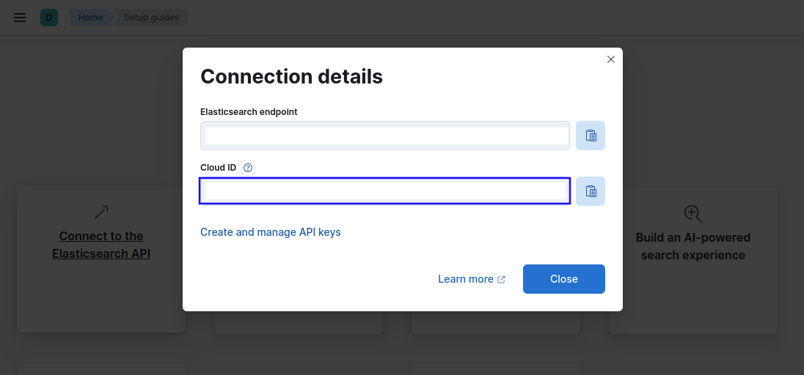
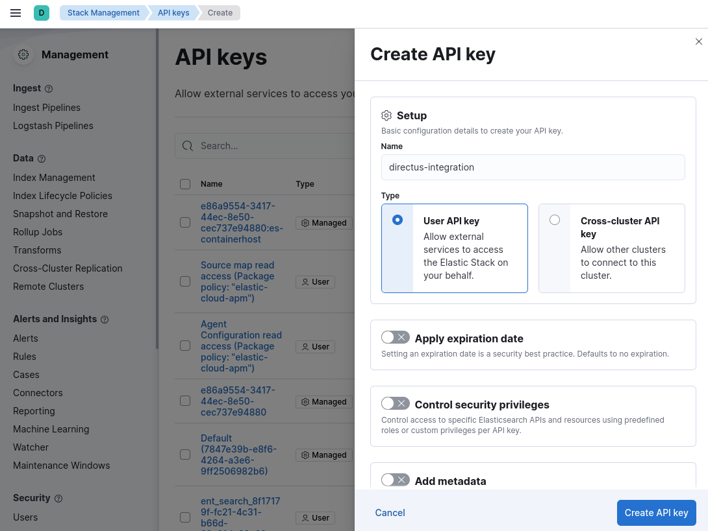

Directus' built-in search endpoints are suitable for a many projects, but sometimes you might need more. Elasticsearch is a powerful and flexible search system which uses an index of data to perform searches. 

In this tutorial, you will learn how to build a [Custom API Hooks](https://docs.directus.io/extensions/hooks.html) extension to integrate Elasticsearch and keep an index up to date.

## Before You Start

You will need:

- Node >=18.19.0 installed on your system.
- A Directus project running locally - follow the [self-hosting quickstart](https://docs.directus.io/self-hosted/quickstart) if you don’t have one already. Make sure you have a mounted `extensions` directory.
- A running instance of Elasticsearch. For this tutorial, [Elastic Cloud](https://www.elastic.co/cloud/elasticsearch-service/signup) will be used.

## Getting Elasticsearch Connection Details

To connect to Elasticsearch the Cloud ID and API key credentials will be used. In your Elastic Cloud deployment, click on **Setup guides -> Connect to the Elasticsearch API** card and you will see your Cloud ID.



Now to get an API key, click on **Create and manage API keys,** then at the top-right of the navigated page click **Create API key.** Enter the name and click **Create API key** at the bottom-right of the sidebar.



Copy the displayed API key as well as the Cloud ID and add them to your environment variables:

```shell
ELASTIC_API_KEY=<your-api-key>
ELASTIC_CLOUD_ID=<your-cloud-id>
```

## Creating a Collection in Directus

The collection to be created is the one that needs to be in sync with an Elasticsearch index. In your Directus Admin App, navigate to **Settings -> Data Model** and create a new collection called `books` with a text input called `title` and a textarea field called `description`.


## Creating a Custom Hook Extension

Custom hook extensions allow running custom logic triggered by an event emitted by Directus. These events includes key database events like item creation and deletion.

For this use case where an Elasticsearch index is to be updated when an item is created, updated, or deleted in a Directus collection to keep the index and collection in sync, you will use an `action` hook, which will run after an event has occurred.

In the terminal, enter the following command in the your mounted extensions directory:

```shell
npx create-directus-extension@latest
? Choose the extension type: hook
? Choose a name for the extension: elasticsearch-sync
? Choose the language to use: JavaScript
? Auto install dependencies? (Y/n) y
```

After that, navigate into the created hook directory and install the Elasticsearch JavaScript Client:

```shell
cd elasticsearch-sync
npm install @elastic/elasticsearch
```

## Connecting to Elasticsearch

To connect to Elasticsearch, modify the `api/src/index.js` file to the following:

```javascript
import { createRequire } from "module";
const require = createRequire(import.meta.url);
const { Client } = require("@elastic/elasticsearch");

export default ({ action }, { env }) => {
  const client = new Client({
    cloud: {
      id: env.ELASTIC_CLOUD_ID,
    },
    auth: {
      apiKey: env.ELASTIC_API_KEY,
    },
  });
};
```

Because Elasticsearch is a CommonJS package, the `require()` function is constructed using the `createRequire()` Node utility method and used to import it to avoid errors. 

The Elasticsearch JavaScript client has been instantiated in the exported register function using the Cloud ID and API key defined within your environment variables and accessed using the `env` argument. 

## Saving Items to an Elasticsearch Index

Add the following lines of code after the `client` variable:

```javascript
action("books.items.create", async (meta) => {
  await client.index({
    index: "books",
    id: meta.key,
    document: meta.payload,
  });
});
```

This `action` hook will be triggered when an item is created in `books` collection. This is achieved by specifying `books.items.create` as the event name. 

When executed a document will be created in an Elasticsearch `books` index containing the newly created item fields which was accessed from the `meta` object. The `meta` object includes the ID of the newly created item in the `key` property and the item fields in the `payload` property.

Although the `books` index was not explicitly created, that will be done automatically if doesn’t exist and a new document is been created which is the default behavior.

## Updating Items in an Elasticsearch Index

Add the following lines of code below the existing action:

```javascript
action("books.items.update", async (meta) => {
  await Promise.all(
    meta.keys.map(
      async (key) =>
        await client.update({
          index: "books",
          id: key,
          doc: meta.payload,
        })
    )
  );
});
```

For an update event, the `meta` object will includes an array of `keys` along with the updated fields even when only a single item is updated. So to modify the corresponding document or documents in `books` index, the array of keys is iterated over to send multiple update requests.

## Deleting Items in an Elasticsearch Index

For a delete event, the `meta` object includes an array of keys of the of the deleted items. Fields are not included. Add the following lines of code after the `books.items.update` action:

```javascript
action("books.items.delete", async (meta) => {
  await Promise.all(
    meta.keys.map(
      async (key) =>
        await client.delete({
          index: "books",
          id: key,
        })
    )
  );
});
```

## Adding Your Custom Hook to Directus

To get the hook working, navigate to the extension directory in the terminal and build it with the following command:

```shell
npm run build
```

Restart your Directus project and when you create, update, or delete items in the `books` collection, the changes will reflect in your Elasticsearch `books` index.

## Summary

With this tutorial, you’ve learned how to synchronize a Dierctus collection with an Elasticsearch index by developing a custom API Hooks extension. You can now go ahead to tweak this for your use case, add error handling, and integrate Elasticsearch with your app.
